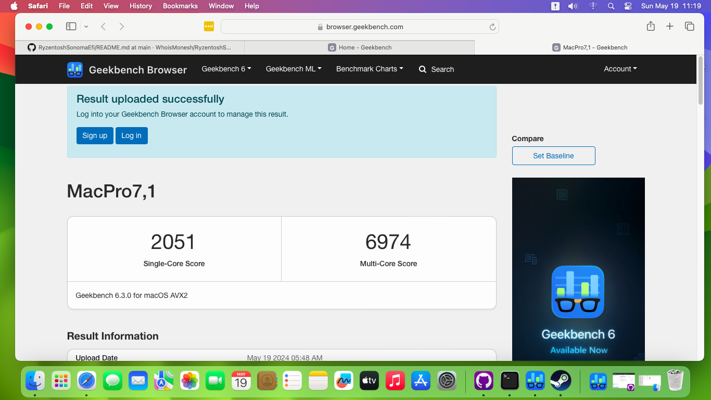

# Ryzentosh Sonoma: macOS on AMD Ryzen 5 5600X

This repository provides a comprehensive guide for installing macOS on an AMD Ryzen 5 5600X system using the Sonoma method.

## Supported Hardware:

- **CPU:** AMD Ryzen 5 5600X
- **RAM:** 16 GB DDR4-3200
- **Motherboard:** Asus Prime A320M-K
- **Graphics:** AMD Radeon RX 580
- **Storage:** KINGSTON SA400S37480G (480 GB, SATA-III)

## Features:

- General computer operation: ✅
- Video acceleration: ✅
- Sound: ✅
- Ethernet: ✅

## Installation:

To set up macOS on your AMD Ryzen 5 5600X system, follow the detailed installation instructions provided [here]
## Screenshots:

Include screenshots demonstrating successful macOS installation and usage.

## Contributing:

We welcome contributions to this project!

## License:

This project is licensed under the MIT License.
